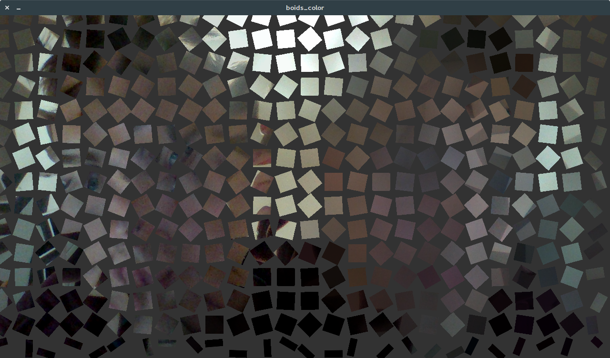
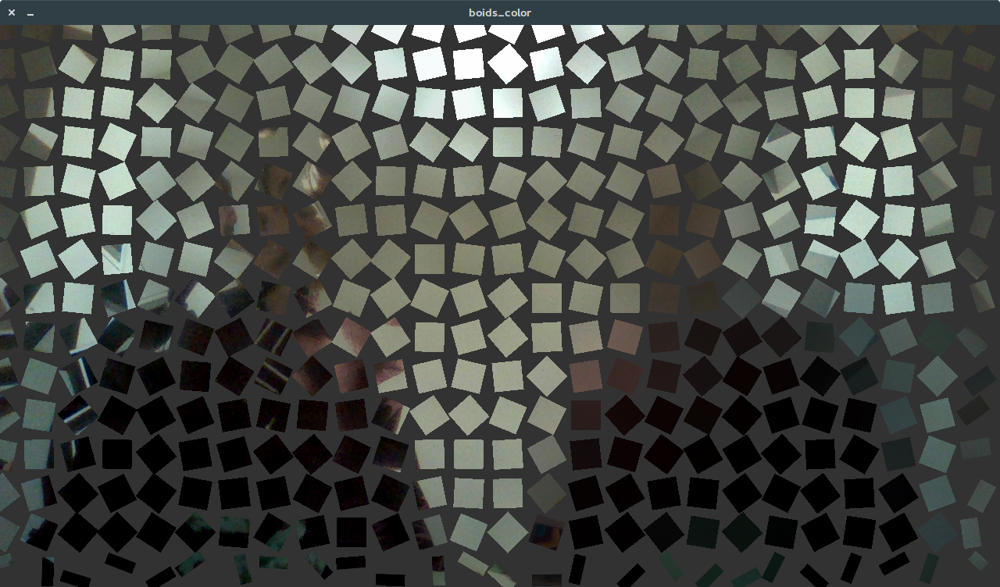

#  Boid Mosaic Mirror
The final product is a modification of the Boid Flocking algorithm applied to the webcam. Or that's what the initial idea was. 
After experimenting with motion using chunks of the image as "Boids", I decided that the best motion is no motion. 
I also tried applying the Boid Algorithm to the <R,G,B> colorspace but was also unhappy with the result. 

The final mirror abstracts what is sees into smaller chunks and tries to mirror an average color. The effect is something of a shadow.
From afar, the "shadow" and the object will be indistinguishable. You can only see the granular differences and the rotation of the individual chunks upon closer
inspection.

## Boid Algorithm
I used [Processing's Example](https://processing.org/examples/flocking.html) of the Boid algorithm to start. 

## Screenshots

### From Close Up

### From Further away

## Video
[Watch it here on Vimeo](https://vimeo.com/255647357)

### Other Screenshots
While developing this, I did a bunch of experiments. I saved the decent ones do their own branches. Here are what they looked like:

Colored Quadrants:

